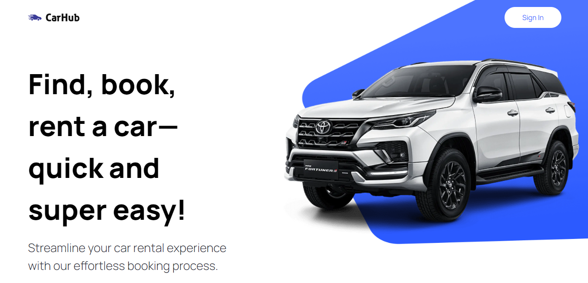
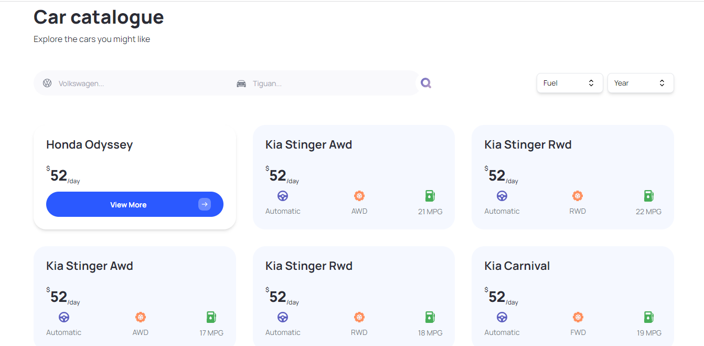
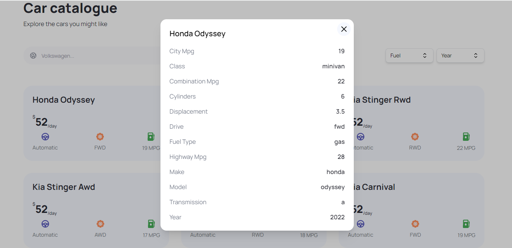

# CarHub

A car showcase application using Next.js 13

- assets
- tailwind config - contains some configuration related to fontFamily, colors, etc.
- globals.css - contains custom tailwind classes created using the [@apply directive](https://tailwindcss.com/docs/functions-and-directives#apply)
- constants - contains fuel, years, manufacturer data
- [headlessui](https://headlessui.com/) - create combobox and dropdowns.
- Rapid API - [Cars API by API Ninjas](https://rapidapi.com/apininjas/api/cars-by-api-ninjas)

```bash
# Clone this repository
$ git clone https://github.com/wallisonmoura/car_showcase.git

# Access the project folder
$ cd car_showcase

# install dependencies
$ yarn

# Run project
$ yarn dev

```
        
### 🎨 Screenshots
<p align="center">
  
  
  
</p>